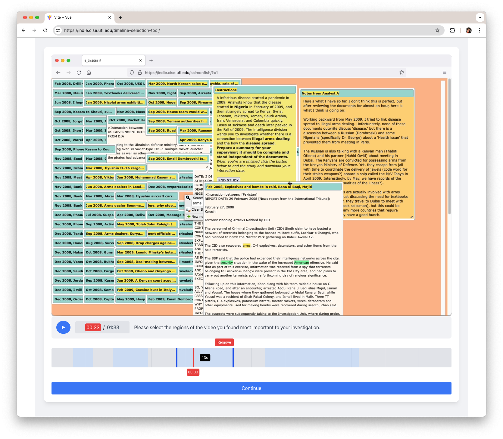

# Video Timeline Region Selector

A web-based video timeline tool that allows users to select, mark, and manage regions of interest within video files directly in the browser. Built with Vue.js, this tool provides an intuitive interface for creating, editing, and managing video time regions.



## Features

### Video Playback

- Load and play local video files (.mp4) directly in the browser
- Real-time video scrubbing with timeline interaction
- Timecode display (HH:MM:SS)
- Basic video playback controls (play/pause)

### Timeline Interface

- Interactive timeline with draggable playhead
- Real-time video preview while scrubbing
- Visual grid markers for time reference
- Hover scrubbing with timecode display

### Region Management

- Create regions by clicking and dragging on the timeline
- Adjust region boundaries using interactive handles
- Real-time timecode display while dragging region handles
- Visual feedback for region duration
- Easy region deletion with remove button
- Multiple independent regions support
- Minimum region size enforcement
- Non-overlapping region constraints

### Data Export

- Export selected regions as JSON (right now to console)
- Durations for each region
- Time-based metadata ready for external processing

## Technical Details

### Built With

- Vue 3 - Frontend framework
- Vuex - State management
- Tailwind CSS - Styling
- HTML5 Video API - Video playback

### Browser Support

- Chrome (recommended)
- Firefox
- Safari
- Edge

### Key Components

- `VideoPlayer.vue` - Handles video playback and controls
- `Timeline.vue` - Main timeline interface
- `TimelineRegion.vue` - Individual region management
- `VideoControls.vue` - Playback controls and timecode display

## Getting Started

### Prerequisites

- Node.js 14.x or higher
- npm or yarn

### Installation

1. Clone the repository:

```bash
git clone https://github.com/yourusername/video-timeline-selector.git
```

1. Install dependencies:

```bash
cd video-timeline-selector
npm install
```

1. Start the development server:

```bash
npm run dev
```

### Usage

1. Load a Video:
   - Click the file input to select a local video file
   - Supported format(s): MP4 (browser-dependent)

2. Create Regions:
   - Click and drag on the timeline to create a new region
   - Regions are highlighted in blue
   - Adjust region bounds using the handles on either end

3. Edit Regions:
   - Drag handles to adjust region start/end times
   - Click the remove button to delete a region
   - Hover over regions to see duration

4. Export Data:
   - Click the Continue button to export region data
   - Region data is logged to the console in JSON format

### Data Format

Exported region data follows this structure:

```json
{
  "regions": [
    {
      "start": 10.5,  // Start time in seconds
      "end": 15.2     // End time in seconds
    }
    // ... additional regions
  ]
}
```

## Contributing

1. Fork the repository
2. Create your feature branch (`git checkout -b feature/AmazingFeature`)
3. Commit your changes (`git commit -m 'Add some AmazingFeature'`)
4. Push to the branch (`git push origin feature/AmazingFeature`)
5. Open a Pull Request

## License

This project is licensed under the MIT License - see the LICENSE file for details.

## Acknowledgments

- The majority of this is built in combination with `Claude-3.5-sonnet-v2`, with some refinement by Jeremy
- Built with Vue.js
- Styling powered by Tailwind CSS
- Inspired by professional video editing tools
- Created for web-based video processing workflows
